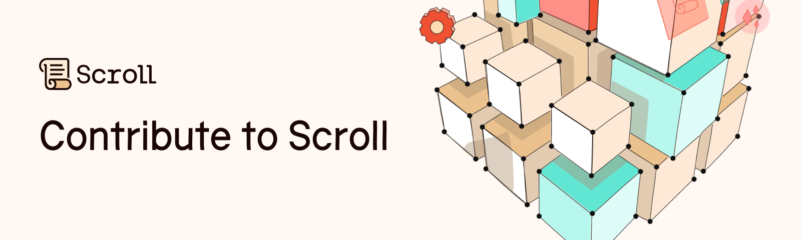

This repository guides developers wanting to contribute to Scroll. You can start contributing today, if you need ideas on getting started check out the [issues](https://github.com/scroll-tech/contribute/issues) tab.

## How to Contribute

Thanks for your interest in contributing to Scroll. Check out the [CONTRIBUTING](https://github.com/scroll-tech/contribute/blob/main/CONTRIBUTING.md) page for a guide on how to contribute.

## Contributions

### Integrations

Scroll has been integrated into the following projects:

- [ethereum-lists/chains](https://github.com/ethereum-lists/chains/)

## About Scroll

Scroll is an open-source zkEVM Layer 2 that helps scale Ethereum. Scroll is bytecode equivalent with the EVM, which makes possible native compatibility for existing Ethereum applications. Learn more about Scroll in [the docs](https://guide.scroll.io/).

## Contributors

